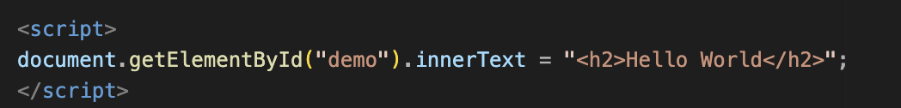
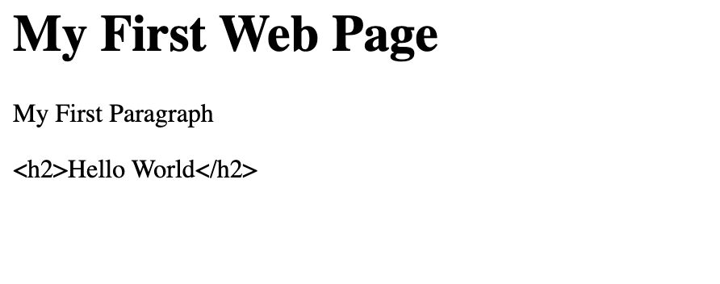
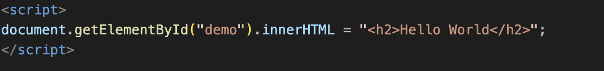
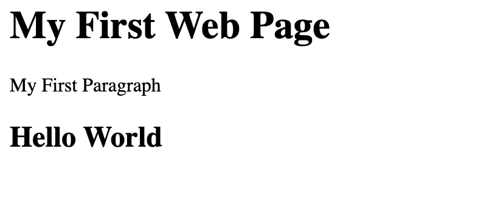

- `getElementById(): lấy một phần tử element trong HTML dựa trên ID`

## JAVASCRIPT FUNCTION

- Function được gọi khi event xảy ra
- Javascript function có thể để ở head, body của html
- Đặt script ở cuối thẻ body sẽ giúp trang web hiển thị nhanh hơn, vì trình duyệt sẽ dừng việc hiện thị để đọc và thực thi js (Nếu đặt script đầu trang, user phải chờ js chạy xong mới thấy nội dung.

## **JAVASCRIPT OUTPUT**

### JavaScript Display Possibilities

`innerHTML` hoặc `innerText` -> hiển thị nội dung lên một phần tử html (). innerHTML: có thể hiển thị cả thẻ html, innerText:chỉ hiển thị văn bản

document.write(): ghi trực tiếp vào trang web.Nếu gọi sau khi trang đã tải xong, nó sẽ ghi đè toàn bộ nội dung trang. Chỉ nên dùng để test

window.alert(): hiển thị hộp thoại popup

console.log()

Javascript không có lệnh print.window.print sẽ mở Print Diaglog để user in trang web hiện tại

## **JavaScript Syntax**

### * Javascript value

- Literals**:** giá trị cố định (có hoặc không có phần thập phân) . JS không phân biệt in và float

**Variables:** biến

### **Javascript Variable**

quy ước: tên biến bắt đầu bằng dấu gạch dưới (`_`) thường được dùng để chỉ các biến "private"

| Khai báo | Global Scope                 | Function Scope | Block Scope |
| --------- | ---------------------------- | -------------- | ----------- |
| `var`   | (nếu khai báo ngoài hàm) | ✅             | ❌          |
| `let`   | (nếu khai báo ngoài hàm) | ✅             | ✅          |
| `const` | (nếu khai báo ngoài hàm) | ✅             | ✅          |

var cho khai báo lại khi cùng scope

let không cho khai báo lại khi cùng scope

**Hoisting** là cơ chế của JavaScript trong đó  **các khai báo (declarations) được "đưa lên đầu" phạm vi (scope) trước khi mã được thực thi** .

var  hoisting và được khởi tạo là undefined

let, const hoisting nhưng bị TDZ, không dùng được trước khi khai báo

biến const không thể trỏ sang một giá trị khác, nhưng nếu giá trị là object hay array thì vẫn sửa được nội dung bên trong

### **JS TYPE**

`typeof : tìm type của JavaScript variable.`
